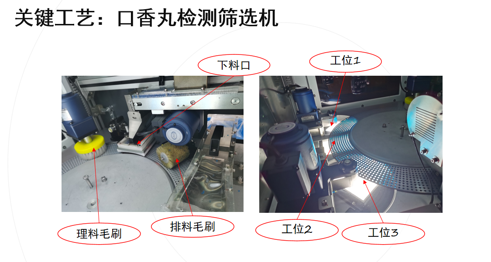
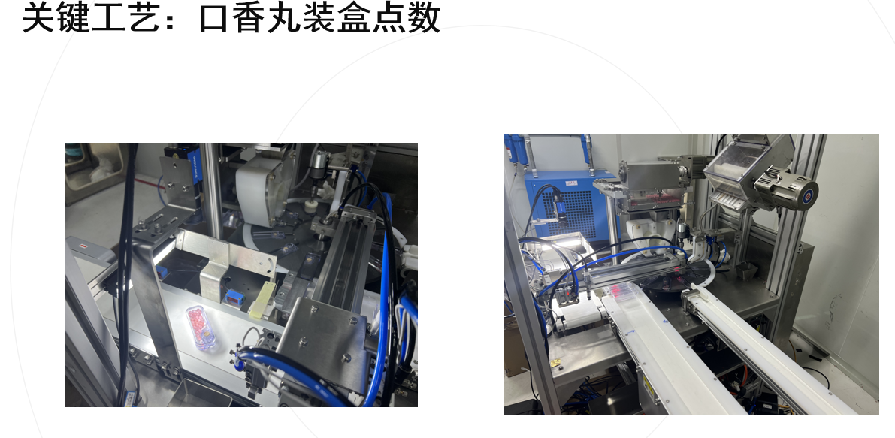
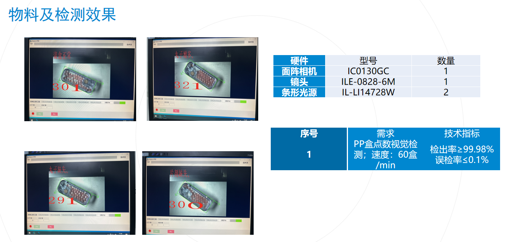

# 学习目标



# 应用说明

## 形状匹配框架——框架简介

## 形状匹配模板配置框架——框架简介

## 形状匹配框架——参数解析

## 灰度匹配框架——框架简介

## 灰度匹配模板配置框架——框架简介

## 灰度匹配框架——参数解析

## Mark点提取、亮度计算、清晰度框架——框架简介

## Mark点提取框架——参数解析

## 亮度计算框架——参数解析

## 清晰度框架——参数解析

## 算法原理简介

## 案例研讨

# 随堂笔记

## 使用练习

1. 流程配置

2. 拍摄元件选择全局相机,可在菜单栏相机配置中配置,在相机配置中添加一个全局相机,选择虚拟相机

3. 下方缩略图添加图片

4. 形状配置,选择上一步的图像变量,在形状配置图标中新建模版,掩摸不需要或造成干扰的区域,完成后点击学习,保存

5. 灰度匹配

6. 增加一个拍摄元件,图片选择

7. 通道转换

8. Mark提取

9. 亮度计算,框选区域,检测亮度

10. 清晰度计算,位移可选择灰度匹配的结果补正量

# 课后练习

